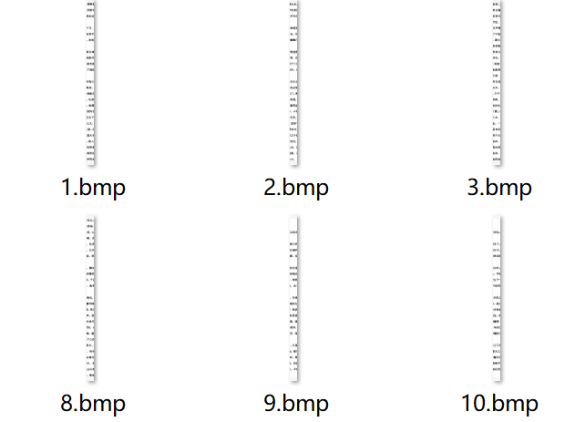
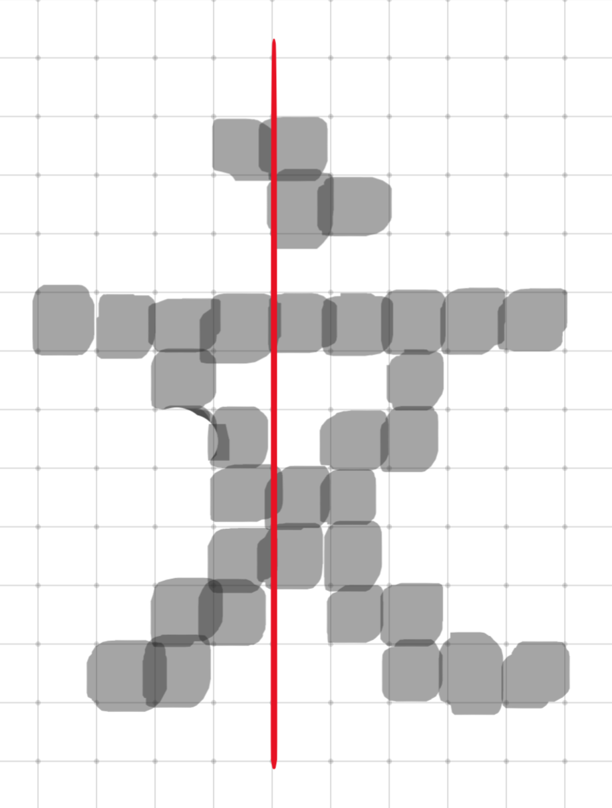
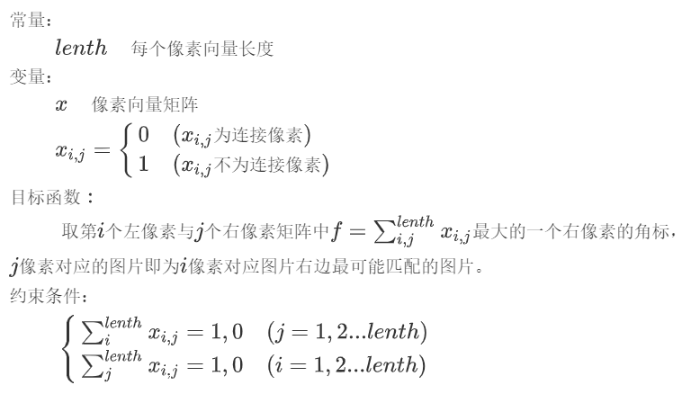
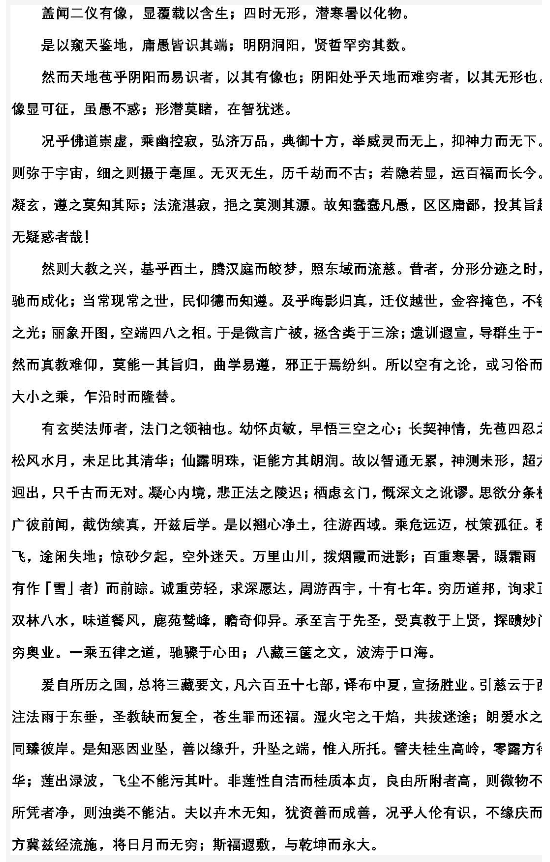
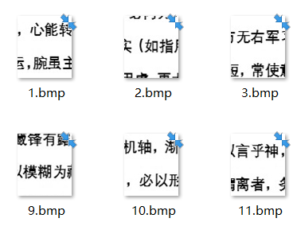
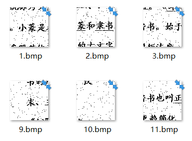
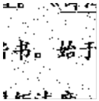
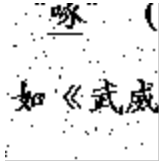
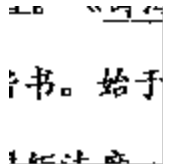
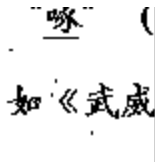

[TOC]

# 碎纸片拼接问题


## 题目重述

图片拼接复原工作，传统上主要由人工完成，其特点准确率较高，但随着图片数量的增加，拼接效率会大大降低。但随着计算机技术的发展，人们试图开发图片的自动拼接技术，以提高拼接复原准确度和拼接效率。对于给定的来自同一页印刷文字（或图片）的碎片（仅纵切或纵横切），请就以下情形讨论拼接复原问题，并建立图片拼接复原模型和提出相应的求解算法，其复原结果以图片及表格形式加以表达，如果在拼接复原过程中需要人工干预，请给出干预的方式及干预的次数，并尽可能实现拼接过程的自动化与干预的交互操作（如MATALB GUI设计）。

**1.**   仅纵切（中文文字图片，图片文件见附件1）；

**2.**   纵横切（中文文字图片，图片文件见附件2）；

**3.**   纵横切（含噪文字图片，图片文件见附件3）；

**4.**   纵横切（彩色图片，图片文件见附件4）；

# 第一问

题目给出如下纵切碎纸片



## 解题思路

图片均是由像素组成，换言之，就是由若干有颜色的像素块组成，在图片中，黑色的像素块组成文字。

文字被纵切之后，由于其笔画原本也是连通的，所以取出每一幅图片的最右边或最左边的像素，必然有另一幅图片的最左边或最右边的像素与之对应。



单个文字的匹配率不应该很高，上图是手绘的一个文字像素，其中切割线左边有6个黑色像素，左边只有4个黑色像素，并且不都是匹配的，即不是连接的。

但纵向切割的断面上有很多文字，如果我们以匹配的像素点的总个数作为匹配度函数值，两两匹配的纸片的断面文字匹配程度要比非匹配的纸片高得多。

我们可以依次读取每个图片的数据，取其左右两边的像素并分别保存到两个列表中，这样所有图片的左像素和右像素都被保存下来了，我们可以分别用15个图片的左右像素构成15*15个像素矩阵，该矩阵除对角线元素可以是0或1外，其他的必须为0或NaN（不存在）。

因此我们的模型为：



## 程序设计

### 代码

我们利用Python的PIL图像处理库解决此问题，程序将会在图片文件夹中直接生成拼接好的图像。

```python
# -*- coding: utf-8 -*-
"""
Created on Mon Aug 31 19:42:33 2020

@author: LiSunBowen

运行程序前，先把所有图片文件放置在同一文件夹下，并且按数字顺序命名，本程序将文件夹命名为“附件1-纵切文字”，程序在文件夹外，请参考相对路径放置各文件
"""

from PIL import Image

cap = []
for i in range(1,16): # 循环次数为图片个数
    cap.append("附件1-纵切文字\\{}.bmp".format(i))
pixelr = [] # 每张图右边像素向量
pixell = [] # 每张图左边像素向量
for j in cap: # 读取各图片两侧向量
    captcha = Image.open(j)
    width = captcha.size[0]
    height = captcha.size[1]
    a = []
    b = []
    for i in range(height):
        if captcha.getpixel((-1,i)) < 150:
            a.append(1)
        else:
            a.append(0)
    pixelr.append(a)  # 保存右向量
    for i in range(height):
        if captcha.getpixel((0,i)) < 150:
            b.append(1)
        else:
            b.append(0)
    pixell.append(b) # 保存左向量

su = []
for kn in range(len(pixell)): # 遍历右向量 kn 15
    num = []
    for i in range(len(pixell)): # 遍历左向量 i 15
        n = 0
        for j in range(len(pixell[i])): # j是pixell[i]里面的各元素 j 1809
            if pixell[kn][j] == pixelr[i][j] and pixelr[i][j] == 1:
                n += 1
        num.append(n)
    if max(num) == 0: # 最左边的图片最大值就是0，以此选出最左边的图片，记为0
        su.append(0)
    else:
        su.append(num.index(max(num))+1)
# su列表的含义：例如 [15, 1, 6,...]，表示第1个图片的左边是第15个图片，第2个图片左边是第1个图片，以此类推

new = []
nd = []
for i in range(len(su)):
    nd.append([su[i],i+1])
# nd列表的含义：类似su，但重新排列了
new = [] # new列表用来排图片次序，利用迭代的方法排序
mark = 0 # 此处涉及到迭代，先定义一个初值
for km in range(len(nd)):
    for i in nd:
        if i[0] == mark:
            new.append(i[1])
            mark = i[1]
# new 是保存图片顺序的列表

def join(png1, png2, flag='horizontal'):
    """
    :拼接函数:
    :param png1: path
    :param png2: path
    :param flag: horizontal or vertical
    :return:
    """
    img1, img2 = Image.open(png1), Image.open(png2)
    size1, size2 = img1.size, img2.size
    if flag == 'horizontal': # 横向拼接
        joint = Image.new('RGB', (size1[0]+size2[0], size1[1]))
        loc1, loc2 = (0, 0), (size1[0], 0)
        joint.paste(img1, loc1)
        joint.paste(img2, loc2)
        return joint
    elif flag == 'vertical': # 纵向拼接
        joint = Image.new('RGB', (size1[0], size1[1]+size2[1]))
        loc1, loc2 = (0, 0), (0, size1[1])
        joint.paste(img1, loc1)
        joint.paste(img2, loc2)
        return joint

# 开始拼接图像
joint = join(cap[new[0]-1], cap[new[1]-1]) # 此处涉及到迭代，先定义一个初值joint（拼接头两个图片）
joint.save('附件1-纵切文字//joint.bmp') # 保存头两个图片合成的图片
for i in range(2,len(su)-1):
    joint = join('附件1-纵切文字\\joint.bmp', cap[new[i]-1]) # 将已保存的图片与右边的图片拼接
    joint.save('附件1-纵切文字\\joint.bmp') # 保存新拼接的图片
print('图片已经保存为：附件1-纵切文字\joint.bmp')
joint.show()
```

## 输出



# 第二问和第三问

## 第二问碎纸片预览



## 第三问碎纸片预览



## 统一解题

第二问和第三问很类似，都是纵横切，第三问只是在第二问的基础上加上了噪点，噪点很容易处理，处理之后就和第二问几乎一样，因此放在一起分析。

## 降噪程序

第三问给的图片中都有噪点，我们先编写一个降噪函数。

降噪思路为：经过观察，噪点都是单个像素点，我们只需要遍历所有图片的所有像素点，并且判断深色像素点上下左右是否都有深色像素点，若都没有深色像素点，则认定为是噪点，我们可以将这个像素点颜色替换为白色，即可实现降噪。

对于文字来说，通常不会出现单个像素点的情况，所以文字受影响极小。

下面这个降噪函数中需要输入一个参数im，是需要降噪的图片，需要用```PIL.Image.open(filepath)```的方法读取出来。

```python
def convert_img(im):
    im = im.convert('1')
    data = im.getdata()
    w,h = im.size
    #im.show()
    black_point = 0
    for x in range(w-1):
      for y in range(h-1):
        mid_pixel = data[w*y+x] #中央像素点像素值
        if mid_pixel == 0: #找出上下左右四个方向像素点像素值
          top_pixel = data[w*(y-1)+x]
          left_pixel = data[w*y+(x-1)]
          down_pixel = data[w*(y+1)+x]
          right_pixel = data[w*y+(x+1)]
          #判断上下左右的黑色像素点总个数
          if top_pixel != 0:
            black_point += 1
          if left_pixel != 0:
            black_point += 1
          if down_pixel != 0:
            black_point += 1
          if right_pixel != 0:
            black_point += 1
          if black_point >= 4:
            im.putpixel((x,y),225)
          #print black_point
          black_point = 0
    return im
```


## 降噪效果

原图：



降噪图：



可见大部分噪点都被有效去除了，效果还是不错的。

## 解题思路

纵横切片的图片很难用第一问的方法解决。

因为只有少数文字，很容易出现错误匹配。

因此我们可以先定义一个长度等于图片高度的空数组，作为向量，可以先横向遍历像素，只要该行有像素就在对应的空数组的位置添加元素1，否则为0 **（用每一行像素点的个数的归一化值比较好，可以改进）**，这样横向文字排列情况相同的就容易被聚类为一组，也就是有大概率是在同一行，转化为第一问的问题。

通过以上步骤，每个图片都有一个向量表示文字所在区域，接下来就可以进行聚类，把文字所在区域类似的聚类为一类，按照题目信息，图片是8*12个，有8行，因此可以分为8类。

### 聚类函数

```python
import pandas as pd
from sklearn.cluster import KMeans
def cluster(features,n): #n 聚类个数，即行数（人为调整得到）
    kmodel = KMeans(n)
    kmodel.fit(features)
    label = pd.Series(kmodel.labels_)
    num = pd.Series(kmodel.labels_).value_counts()
    dist = {}
    for n in range(n):
        ls = []
        for i in range(len(label)):
            if label[i] == n:
                ls.append(i+1)
        dist[n] = ls
    return num,dist
```

处理完毕后可以得到8类图片。

但分类并不准确，理想情况下应该是每一类有8个图片，但是实际上差别很大，据观察，聚类精度还应该提高，并且存在仅有单行文字的图片，不容易与有两行文字的图片聚在一类。

## 完整程序

```python
# -*- coding: utf-8 -*-
"""
Created on Mon Aug 31 19:42:33 2020

@author: LiSunBowen
"""
import pandas as pd
from sklearn.cluster import KMeans
from PIL import Image

def convert_img(im): # 降噪
    im = im.convert('1')
    data = im.getdata()
    w,h = im.size
    #im.show()
    black_point = 0
    for x in range(w-1):
      for y in range(h-1):
        mid_pixel = data[w*y+x] #中央像素点像素值
        if mid_pixel == 0: #找出上下左右四个方向像素点像素值
          top_pixel = data[w*(y-1)+x]
          left_pixel = data[w*y+(x-1)]
          down_pixel = data[w*(y+1)+x]
          right_pixel = data[w*y+(x+1)]
          #判断上下左右的黑色像素点总个数
          if top_pixel != 0:
            black_point += 1
          if left_pixel != 0:
            black_point += 1
          if down_pixel != 0:
            black_point += 1
          if right_pixel != 0:
            black_point += 1
          if black_point >= 4:
            im.putpixel((x,y),225)
          #print black_point
          black_point = 0
    return im

# 运行程序前，先把所有图片文件放置在同一目录下，并且命名按照数字顺序依次命名
def get_feature(di = range(1,97)):
    cap = []
    for i in di: # 循环次数为图片个数
        cap.append("附件3-带噪纵切与横切图片\\{}.bmp".format(i))
    features = []
    for j in cap:
        captcha = Image.open(j)
        captcha = convert_img(captcha)
        width = captcha.size[0]
        height = captcha.size[1]
        sa = []
        for i in range(height):
            a = []
            for j in range(width):
                if captcha.getpixel((j,i)) < 250:
                    a.append(1)
            if sum(a) >= 1:
                sa.append(1)
            else:
                sa.append(0)
        features.append(sa) # 直接用0,1表示，相当于归一化了
    features = pd.DataFrame(features) # 用于聚类
    return features
features = get_feature()

# 开始聚类
def cluster(features,n): # n 聚类个数，即行数（人为调整得到）
    kmodel = KMeans(n)
    kmodel.fit(features)
    label = pd.Series(kmodel.labels_)
    num = pd.Series(kmodel.labels_).value_counts()
    dist = {}
    for n in range(n):
        ls = []
        for i in range(len(label)):
            if label[i] == n:
                ls.append(i+1)
        dist[n] = ls
    return num,dist

num,dist = cluster(features,12) # 拿到聚类结果
num = num.sort_index()
'''
目前的问题是聚类结果是否可靠，通过肉眼观察发现比较可靠，特别是第8组图片[37, 44, 72, 73, 93]
理论上说分出来的组应该是矩形，由题知道应该分8组，每组12个图片
'''
# 输出全部内容
print(num)
print()
print(dist)

'''
dist 是初始分类，但至此，并没有准确的将同一行的图片分类出来，没有完全解出题目。
建议后续将分类出来的图片进行人工筛选和拼接，该程序大大缩小了拼接范围，减小了拼接压力。
'''
```


### 后续思路（暂未在程序上实现）

在单行文字下方加一行虚拟文字，这样就容易与多行图片进行聚类。

聚类的原数据需要改进。

# 存在的问题

如果实现了较好的聚类，可以进行横向自动拼接，但纵向拼接依然是一个比较麻烦的问题，理论上说可以以行距作为判断依据——两行文字之间的间隔是几乎一致的。

